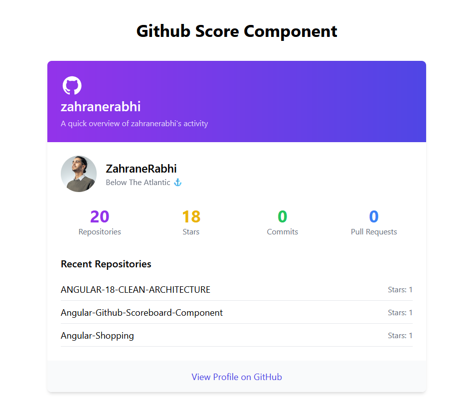
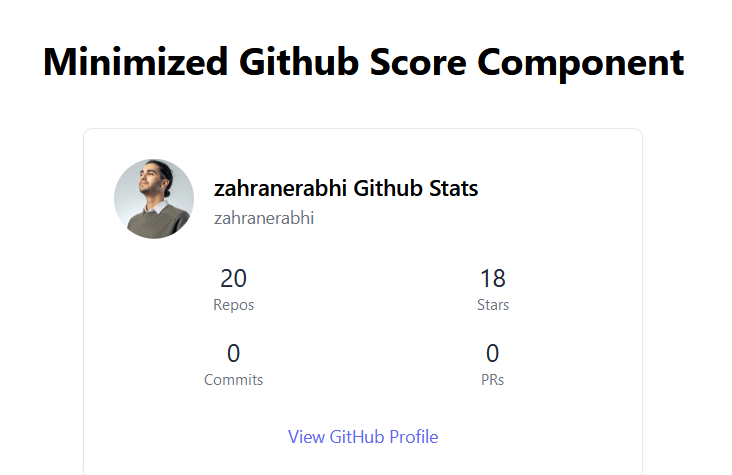

# NgGithub Component

The **NgGithub** component is an Angular 18 component that fetches a user's GitHub profile and repositories data using the GitHub API and displays them in a responsive, minimalist component styled with Tailwind CSS, its importance comes when showcasing your GitHub activities and skill in your Web Portfolio.

<div align="center">
	<code></code>
	<code></code>
	<code></code>
	<code></code>
</div>

## Live Preview 

## Features
- Fetches GitHub user data (profile info and repositories data) using GitHub API.
- Displays user profile information such as avatar, bio, and follower count.
- Lists repositories with stars, forks, and language details.
- Responsive design using Tailwind CSS.

## Overeview
<div align="center">
  
 
</div>

## Installation

### Prerequisites
Ensure you have the following installed:
- [Node.js](https://nodejs.org/) (v16 or later)
- [Angular CLI](https://angular.io/cli) (v18 or later)
- [Tailwind CSS](https://tailwindcss.com/) configured for Angular

### Step 1: Clone the repository
```bash
git clone https://github.com/ZahraneRabhi/ng-github-stats-component
cd ng-github
```

### Step 2: Install Dependencies
```bash
npm install
```

### Step 3: Run the App
```bash
npm start
```

# Note
This component uses the free tier GitHub API endpoints, which have limited API calls. As a result, the component may not always display the stats correctly(or even display them at all💀)

